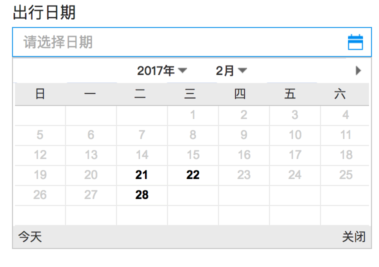
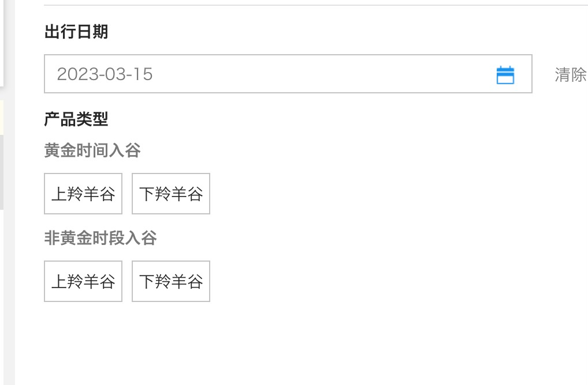
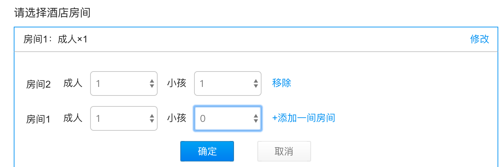
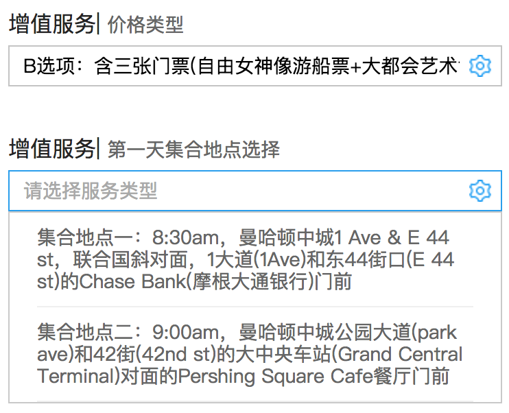
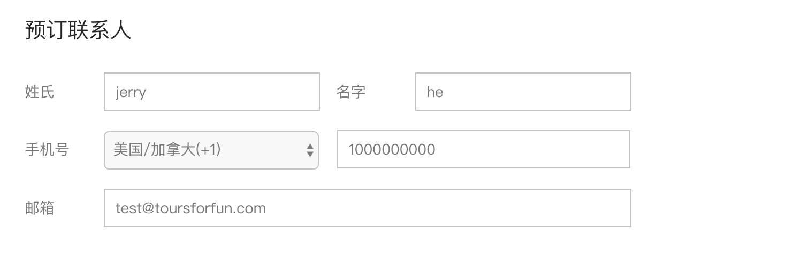
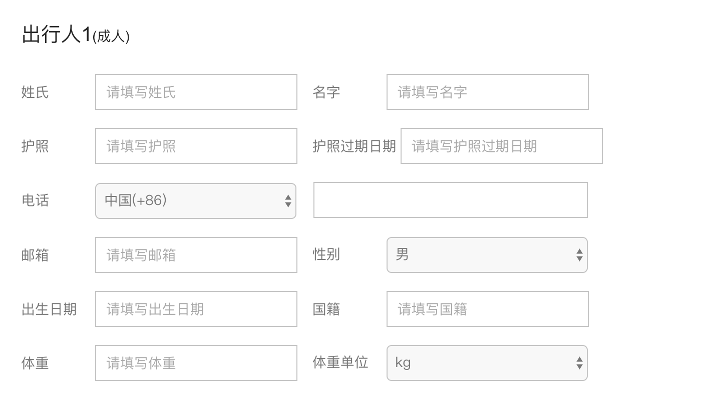

# 产品订购的流程

### Step 0 : 根据[产品详情接口](./product/v2/detail.md)构建产品介绍页面

****

### Step 1 : 通过请求[可售日期接口](./product/v2/availabilities.md)构建可选日期控件，例如

****

### Step 2 : 根据产品线的不同，自行构建 **[sku]** 或 **[房型选择]** 控件，例如

- TTD

- 多日游

****

### Step 3 : 通过请求[升级项接口](./product/v2/upgrades.md)，构建升级项选择控件(仅限多日游产品)，例如

**注意：**
> 1.要根据 升级项接口 返回数据里 `can_multi_select`和`required`两个字段决定升级项控件采取何种样式。
>
> 2.`can_multi_select` 表示该选项是多选控件
>
> 3.`required`表示该选项需要勾选的项目数量（ 0 表示不限制数量 ）
>

### Step 4 : 根据以上内容，调用[价格计算接口](./order/V2/cal_v2.md)实时预览价格

尽管这一步并不是必须的，但是我们建议这么做，让用户实时看到订购总价。

### Step 5 : 收集联系人及出行人信息

- 联系人信息

	每个订单都需要收集一个联系人信息，并且需要填写的信息是固定的，具体字段请看[创建订单接口](./order/V2/add_order_v2.md)，例如

	

- 出行人信息

	出行人信息需要填写的内容，是因应产品的不同而有差异的。

	在[产品详情接口](./product/v2/detail.md)里 `passengerForm`字段，我们通过一个约定的数据结构来描述字段信息，以下是一个例子:

		"firstname_en": {
          "switch": "default",
          "name": "firstname_en",   //最后提交数据时的字段名
          "label": "姓氏",  //用于显示在页面上的名字，
          "type": "text", //字段的类型，有text(字符串),number(数字),select(下拉选择)等
          "min": "5", //最小值，类型为number时有效
          "max": "40",//最大值，类型为number时有效
          "options": [
            "1" : "Tom",
            "2" : "Jerry"
          ], //取值列表，类型为select时有效
          "placeholder": ""
        }

       `base.product_passenger`数组里会有多个这样的结构，用于描述出行人信息的几个字段，我们需要根据以上规则，生成对应的HTML表单，例如
       

 ### Step 6 : 最后，打包以上数据，调用接口创建订单

 发送请求创建订单，具体格式参考 [创建订单接口](./order/V2/add_order_v2.md)。
