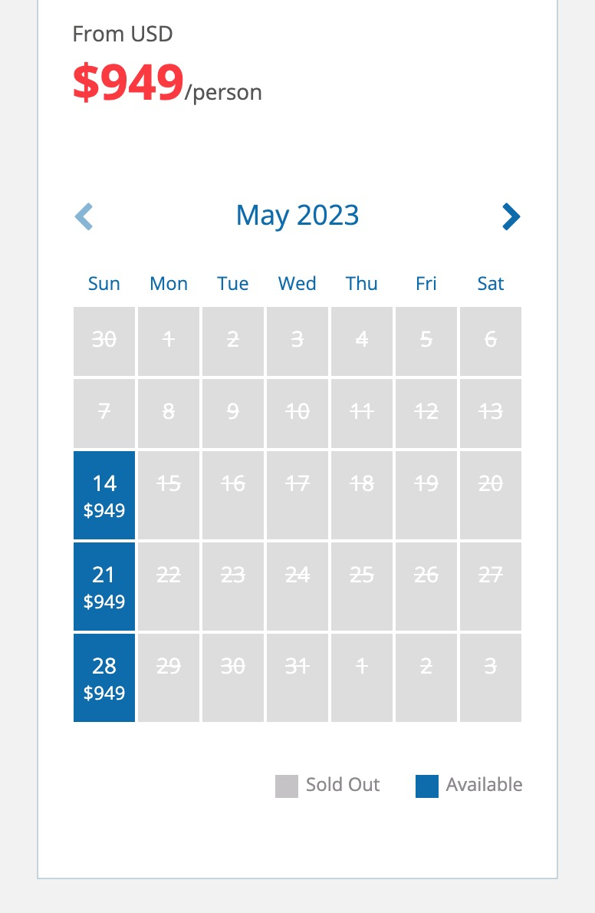
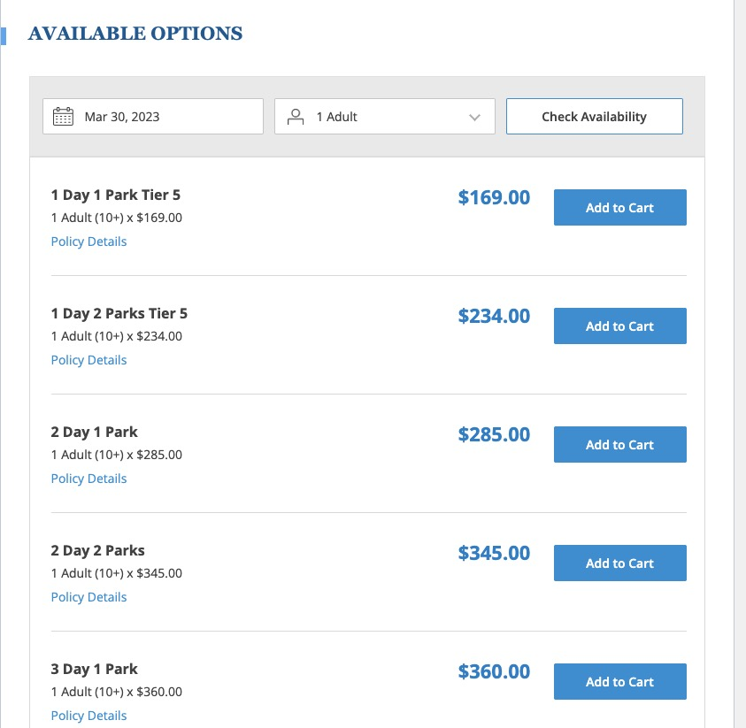
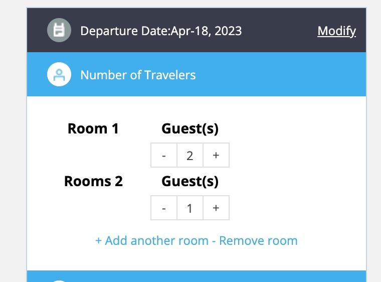
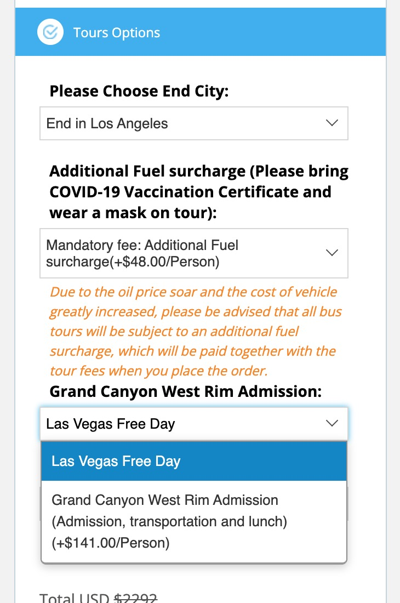
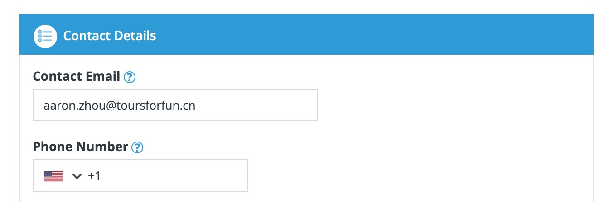
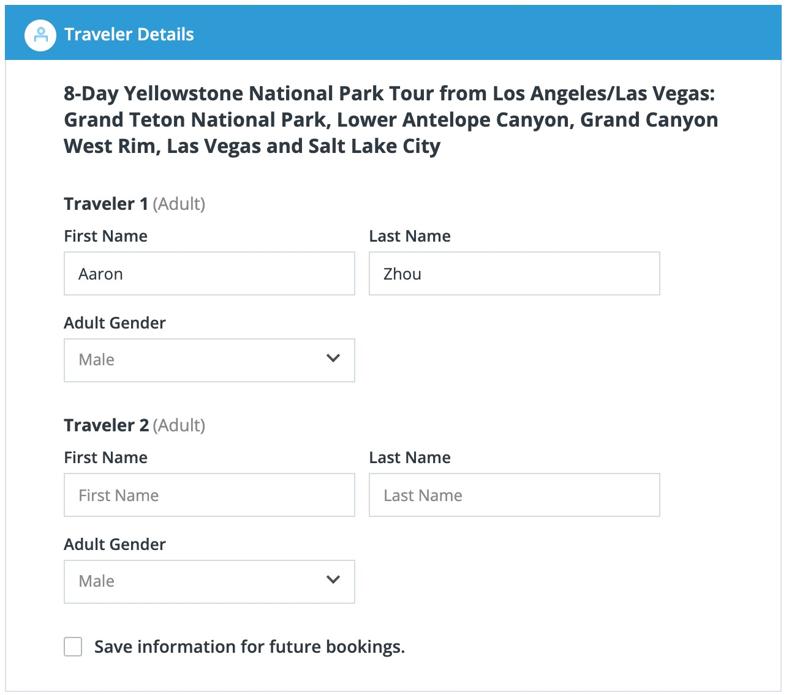

# Process of product purchase

### Step 0 : Build product details page according to [Product Detail API](./product/v2/detail.md),You can refer to the product details page of Tours4fun [5-Day Yellowstone National Park Tour from Seattle: Spokane, Grand Teton National Park, Missoula and Coeur d’Alene](https://www.tours4fun.com/yellowstone-grand-teton-sightseeing-5-day-tour.html)

****

### Step 1 : Build tour product calendar by requesting [Product Available Date And Price API](./product/v2/availabilities.md), for example

****

### Step 2 : Depending on the product line, build your own **[sku]** or **[room type selection]** modules, for example

- TTD

- Tour package

****

### Step 3 : Build upgrades and departure location selection module (only for tour package products) by requesting [Product Upgrades API](./product/v2/upgrades.md), for example

**Note:**
> 1.According to the two fields `can_multi_select` and `required` in the returned data of the product upgrades API, it is necessary to determine what style the upgrade item control adopts.
>
> 2.`can_multi_select` means that the option is multi-select.
>
> 3.`required` means the number of option must selected.
>

### Step 4 : According to the above process, call [price calculation API](./order/V2/cal_v2.md) to preview the price in real time.

Although this step is not required, it is recommended to allow users to see the total price of the order in real time.

### Step 5 : Collect contact and traveler information

- Contact information

	Each order needs to collect a contact information, and the information that needs to be filled in is fixed. For specific fields, please refer to [Create Order API](./order/V2/add_order_v2.md), for example

	

- Traveler information

	The fields that needs to be filled in for traveler information varies with different products.

	In[Product Detail API](./product/v2/detail.md) `passengerForm`field，We describe the field information through an agreed data structure, the following is an example:

		"firstname_en": {
         "switch": "default",
           "name": "firstname_en", //field name when submitting data
           "label": "surname", // used to display the first name on the page,
           "type": "text", //The type of the field, including text (string), number (number), select (drop-down selection), etc.
           "min": "5", //Minimum value, valid when the type is number
           "max": "40",//maximum value, valid when the type is number
           "options": [
             "1" : "Tom",
             "2" : "Jerry"
           ], //value list, valid when the type is select
          "placeholder": ""
        }

       `base.product_passenger`There will be multiple such structures in the array, which are used to describe several fields of pedestrian information. We need to generate the corresponding HTML form according to the above rules, for example
       

 ### Step 6 : Finally, pack the above data and call the API to create an order

 Call create order API. For the specific format, please refer to [Create Order Interface](./order/V2/add_order_v2.md)。
